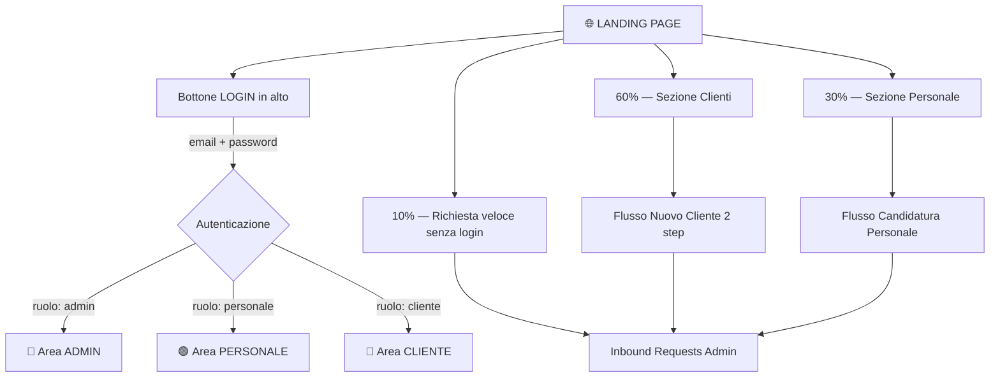
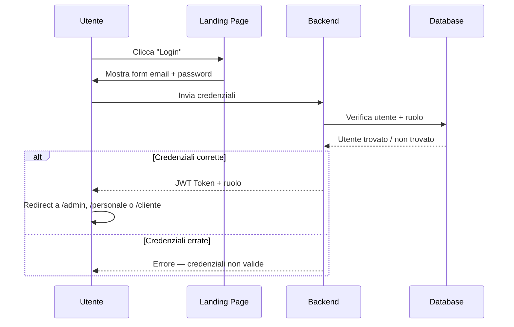
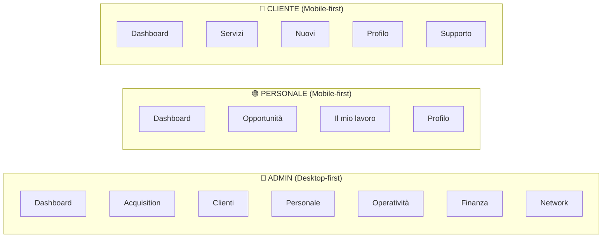

# ATLAS — Flusso Generale dell'App

## Panoramica: 3 Attori del Sistema

```mermaid
graph TD
    LP[🌐 LANDING PAGE] --> LOGIN[Bottone LOGIN in alto]
    LP --> SEZIONE_CLIENTI[60% — Sezione Clienti]
    LP --> SEZIONE_PERSONALE[30% — Sezione Personale]
    LP --> RICHIESTA_VELOCE[10% — Richiesta veloce senza login]

    LOGIN --> |email + password| AUTH{Autenticazione}
    AUTH --> |ruolo: admin| ADMIN[🔴 Area ADMIN]
    AUTH --> |ruolo: personale| PERSONALE[🟢 Area PERSONALE]
    AUTH --> |ruolo: cliente| CLIENTE[🔵 Area CLIENTE]

    SEZIONE_CLIENTI --> NUOVO_CLIENTE[Flusso Nuovo Cliente 2 step]
    SEZIONE_PERSONALE --> NUOVA_CANDIDATURA[Flusso Candidatura Personale]
    RICHIESTA_VELOCE --> IR[Inbound Requests Admin]

    NUOVO_CLIENTE --> IR
    NUOVA_CANDIDATURA --> IR
```

---

## Flusso Login

```mermaid
sequenceDiagram
    participant U as Utente
    participant LP as Landing Page
    participant API as Backend
    participant DB as Database

    U->>LP: Clicca "Login"
    LP->>U: Mostra form email + password
    U->>API: Invia credenziali
    API->>DB: Verifica utente + ruolo
    DB-->>API: Utente trovato / non trovato
    alt Credenziali corrette
        API-->>U: JWT Token + ruolo
        U->>U: Redirect a /admin, /personale o /cliente
    else Credenziali errate
        API-->>U: Errore — credenziali non valide
    end
```

---

## Struttura Moduli per Ruolo

```mermaid
graph LR
    subgraph ADMIN["🔴 ADMIN (Desktop-first)"]
        A1[Dashboard]
        A2[Acquisition]
        A3[Clienti]
        A4[Personale]
        A5[Operatività]
        A6[Finanza]
        A7[Network]
    end

    subgraph PERSONALE["🟢 PERSONALE (Mobile-first)"]
        P1[Dashboard]
        P2[Opportunità]
        P3[Il mio lavoro]
        P4[Profilo]
    end

    subgraph CLIENTE["🔵 CLIENTE (Mobile-first)"]
        C1[Dashboard]
        C2[Servizi]
        C3[Nuovi]
        C4[Profilo]
        C5[Supporto]
    end
```
