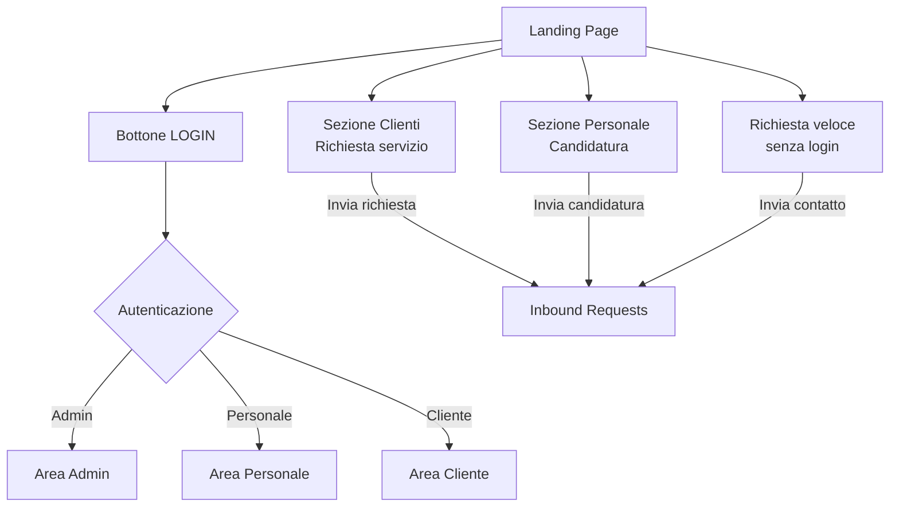

# Landing Page

## Moduli

| Sezione | Spazio | Descrizione |
|---|---|---|
| Login | In alto | Accesso per utenti registrati |
| Clienti | 60% | Richiesta nuovo servizio in 2 step |
| Personale | 30% | Candidatura spontanea |
| Richiesta veloce | 10% | Contatto rapido senza login (es. partner) |

> La landing e' uguale per tutti — il sistema non sa chi sei finche' non fai login.

---

## Flusso

