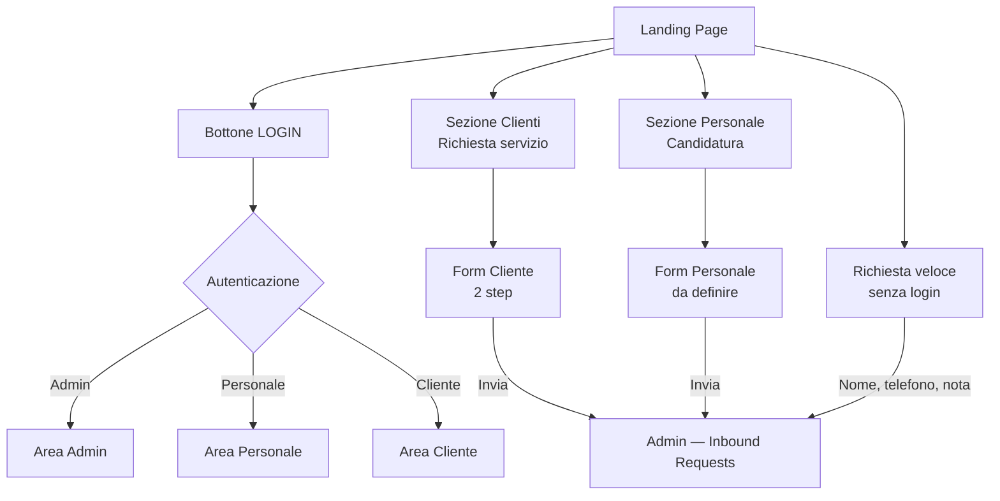
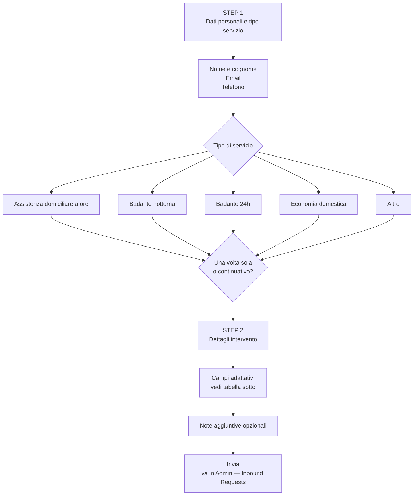

# Landing Page

## Moduli

| Sezione | Spazio | Descrizione |
|---|---|---|
| Login | In alto | Accesso per utenti registrati |
| Clienti | 60% | Richiesta nuovo servizio in 2 step |
| Personale | 30% | Candidatura spontanea |
| Richiesta veloce | 10% | Contatto rapido senza login (es. partner) |

> La landing e' uguale per tutti — la distinzione admin / personale / cliente avviene solo dopo il login.

---

## Flusso 1 — Panoramica Landing Page

```mermaid
flowchart TD
    LP[Landing Page]

    LP --> LOGIN[Bottone LOGIN]
    LP --> RC[Sezione Clienti\nRichiesta servizio]
    LP --> RP[Sezione Personale\nCandidatura]
    LP --> RV[Richiesta veloce\nsenza login]

    LOGIN --> AUTH{Autenticazione}
    AUTH --> |Admin| ADMIN[Area Admin]
    AUTH --> |Personale| PERS[Area Personale]
    AUTH --> |Cliente| CLI[Area Cliente]

    RC --> FC[Form Cliente\n2 step]
    FC --> |Invia| IR[Admin — Inbound Requests]

    RP --> FP[Form Personale\nda definire]
    FP --> |Invia| IR

    RV --> |Nome, telefono, nota| IR
```

---

## Flusso 2 — Form Cliente

Il form e' diviso in 2 step. I campi del secondo step variano in base al tipo di servizio scelto nel primo.

```mermaid
flowchart TD
    S1[STEP 1\nDati personali e tipo servizio]

    S1 --> DATI[Nome e cognome\nEmail\nTelefono]
    DATI --> TIPO{Tipo di servizio}

    TIPO --> A[Assistenza domiciliare a ore]
    TIPO --> B[Badante notturna]
    TIPO --> C[Badante 24h]
    TIPO --> D[Economia domestica]
    TIPO --> E[Altro]

    A --> FREQ{Una volta sola\no continuativo?}
    B --> FREQ
    C --> FREQ
    D --> FREQ
    E --> FREQ

    FREQ --> S2[STEP 2\nDettagli intervento]

    S2 --> CAMPI[Campi adattativi\nvedi tabella sotto]
    CAMPI --> NOTE[Note aggiuntive opzionali]
    NOTE --> INVIA[Invia\nva in Admin — Inbound Requests]
```

### Campi adattativi Step 2

| Tipo servizio | Orario inizio | Durata | Data intervento | Data inizio |
|---|---|---|---|---|
| Assistenza domiciliare a ore — una volta | Si | Si | Si | No |
| Assistenza domiciliare a ore — continuativo | Si | Si | No | Si |
| Badante notturna — una volta | Si | No | Si | No |
| Badante notturna — continuativo | Si | No | No | Si |
| Badante 24h — una volta | No | No | Si | No |
| Badante 24h — continuativo | No | No | No | Si |
| Economia domestica — una volta | Si | Si | Si | No |
| Economia domestica — continuativo | Si | Si | No | Si |
| Altro — una volta | Si | Si | Si | No |
| Altro — continuativo | Si | Si | No | Si |

> Badante notturna: niente durata, si intende l'intera notte.
> Badante 24h: niente orario e niente durata, si intende l'intera giornata.
> Note aggiuntive sempre opzionali in tutti i casi.
