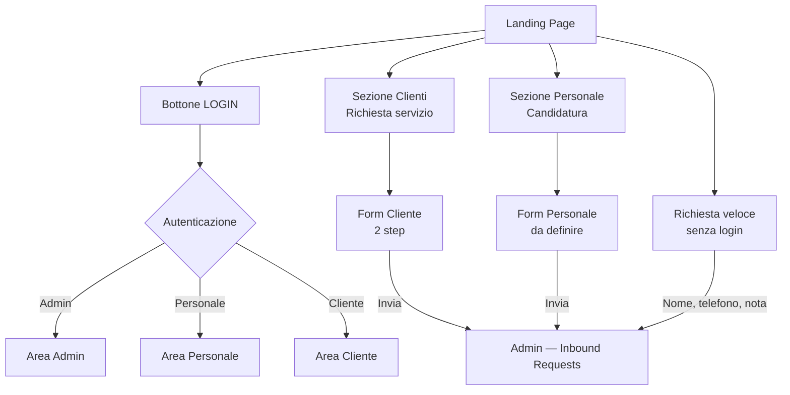
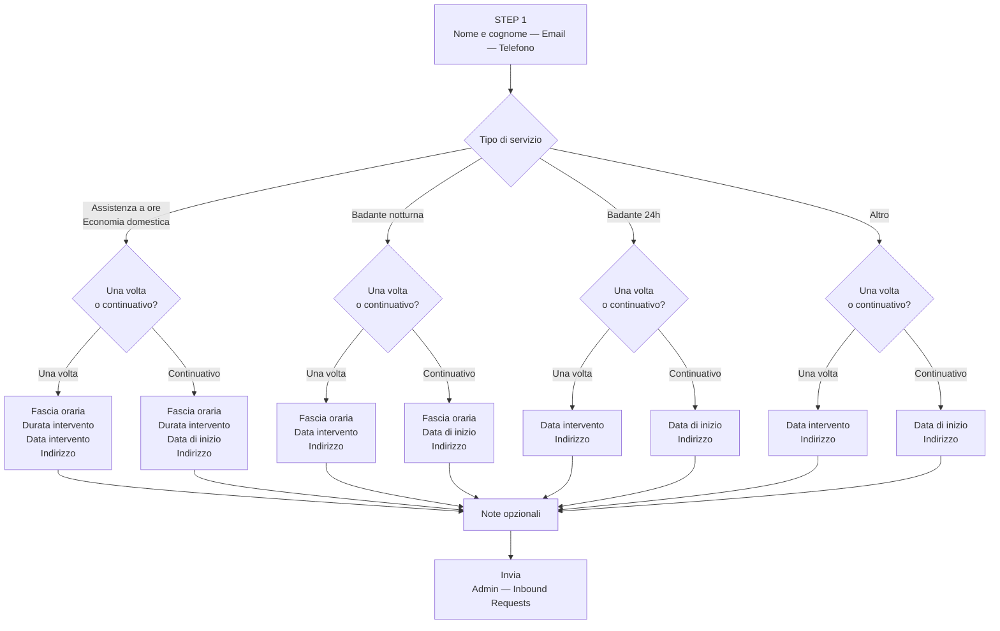
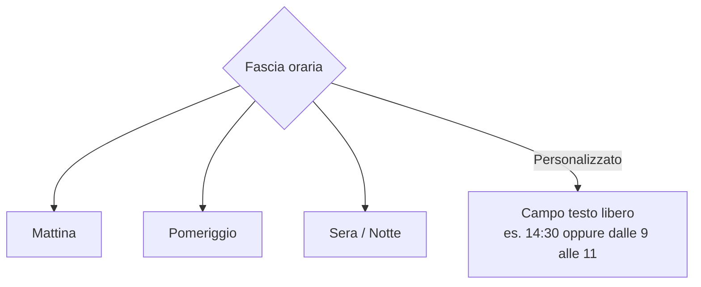

# Landing Page

## Moduli

| Sezione | Spazio | Descrizione |
|---|---|---|
| Login | In alto | Accesso per utenti registrati |
| Clienti | 60% | Richiesta nuovo servizio in 2 step |
| Personale | 30% | Candidatura spontanea |
| Richiesta veloce | 10% | Contatto rapido senza login (es. partner) |

> La landing e' uguale per tutti — la distinzione admin / personale / cliente avviene solo dopo il login.

---

## Flusso 1 — Panoramica Landing Page

```mermaid
flowchart TD
    LP[Landing Page]

    LP --> LOGIN[Bottone LOGIN]
    LP --> RC[Sezione Clienti\nRichiesta servizio]
    LP --> RP[Sezione Personale\nCandidatura]
    LP --> RV[Richiesta veloce\nsenza login]

    LOGIN --> AUTH{Autenticazione}
    AUTH --> |Admin| ADMIN[Area Admin]
    AUTH --> |Personale| PERS[Area Personale]
    AUTH --> |Cliente| CLI[Area Cliente]

    RC --> FC[Form Cliente\n2 step]
    FC --> |Invia| IR[Admin — Inbound Requests]

    RP --> FP[Form Personale\nda definire]
    FP --> |Invia| IR

    RV --> |Nome, telefono, nota| IR
```

---

## Flusso 2 — Form Cliente

Il form e' diviso in 2 step. I campi del secondo step variano in base al tipo di servizio scelto nel primo.

```mermaid
flowchart TD
    S1[STEP 1\nNome e cognome — Email — Telefono]

    S1 --> TIPO{Tipo di servizio}

    TIPO --> |Assistenza a ore\nEconomia domestica| GRP_A{Una volta\no continuativo?}
    TIPO --> |Badante notturna| GRP_B{Una volta\no continuativo?}
    TIPO --> |Badante 24h| GRP_C{Una volta\no continuativo?}
    TIPO --> |Altro| GRP_D{Una volta\no continuativo?}

    GRP_A --> |Una volta| A1[Fascia oraria\nDurata intervento\nData intervento\nIndirizzo]
    GRP_A --> |Continuativo| A2[Fascia oraria\nDurata intervento\nData di inizio\nIndirizzo]

    GRP_B --> |Una volta| B1[Fascia oraria\nData intervento\nIndirizzo]
    GRP_B --> |Continuativo| B2[Fascia oraria\nData di inizio\nIndirizzo]

    GRP_C --> |Una volta| C1[Data intervento\nIndirizzo]
    GRP_C --> |Continuativo| C2[Data di inizio\nIndirizzo]

    GRP_D --> |Una volta| D1[Data intervento\nIndirizzo]
    GRP_D --> |Continuativo| D2[Data di inizio\nIndirizzo]

    A1 --> NOTE[Note opzionali]
    A2 --> NOTE
    B1 --> NOTE
    B2 --> NOTE
    C1 --> NOTE
    C2 --> NOTE
    D1 --> NOTE
    D2 --> NOTE

    NOTE --> INVIA[Invia\nAdmin — Inbound Requests]
```

---

## Flusso 3 — Selezione fascia oraria

Dove richiesto dal tipo di servizio, il campo orario non e' un testo libero ma una selezione a livelli.

```mermaid
flowchart TD
    ORA{Fascia oraria}

    ORA --> M[Mattina]
    ORA --> P[Pomeriggio]
    ORA --> SN[Sera / Notte]
    ORA --> |Personalizzato| CUSTOM[Campo testo libero\nes. 14:30 oppure dalle 9 alle 11]
```
