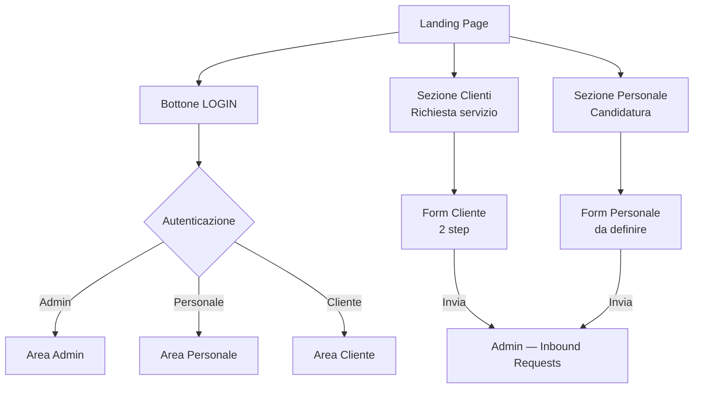
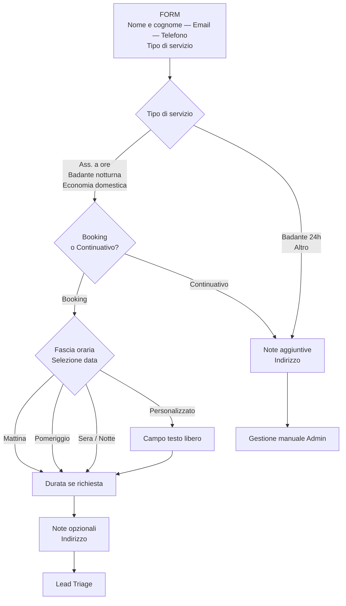

# Landing Page

## Moduli

| Sezione | Spazio | Descrizione |
|---|---|---|
| Login | In alto | Accesso per utenti registrati |
| Clienti | 60% | Richiesta nuovo servizio in 2 step |
| Personale | 40% | Candidatura spontanea |

> La landing e' uguale per tutti — la distinzione admin / personale / cliente avviene solo dopo il login.

---

## Flusso 1 — Panoramica Landing Page

```mermaid
flowchart TD
    LP[Landing Page]

    LP --> LOGIN[Bottone LOGIN]
    LP --> RC[Sezione Clienti\nRichiesta servizio]
    LP --> RP[Sezione Personale\nCandidatura]

    LOGIN --> AUTH{Autenticazione}
    AUTH --> |Admin| ADMIN[Area Admin]
    AUTH --> |Personale| PERS[Area Personale]
    AUTH --> |Cliente| CLI[Area Cliente]

    RC --> FC[Form Cliente\n2 step]
    FC --> |Invia| IR[Admin — Inbound Requests]

    RP --> FP[Form Personale\nda definire]
    FP --> |Invia| IR
```

---

## Flusso 2 — Form Cliente

```mermaid
flowchart TD
    FORM[FORM\nNome e cognome — Email — Telefono\nTipo di servizio]

    FORM --> TIPO{Tipo di servizio}

    TIPO --> |Ass. a ore\nBadante notturna\nEconomia domestica| SCELTA{Booking\no Continuativo?}
    TIPO --> |Badante 24h\nAltro| MANUAL

    SCELTA --> |Booking| ORA{Fascia oraria\nSelezione data}
    SCELTA --> |Continuativo| MANUAL[Note aggiuntive\nIndirizzo]

    ORA --> |Mattina| DUR[Durata se richiesta]
    ORA --> |Pomeriggio| DUR
    ORA --> |Sera / Notte| DUR
    ORA --> |Personalizzato| CUST[Campo testo libero]
    CUST --> DUR

    DUR --> FINE[Note opzionali\nIndirizzo]
    FINE --> LT[Lead Triage]

    MANUAL --> GM[Gestione manuale Admin]
```
