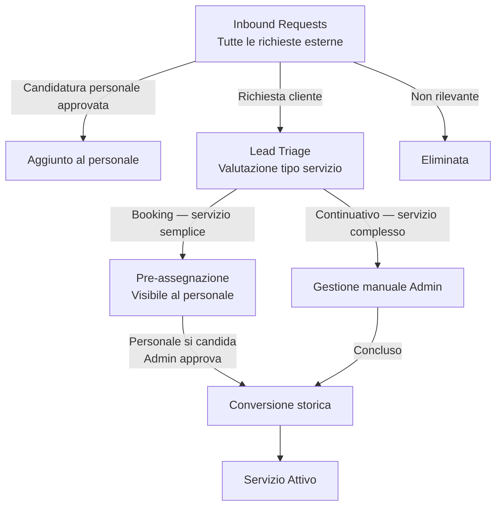
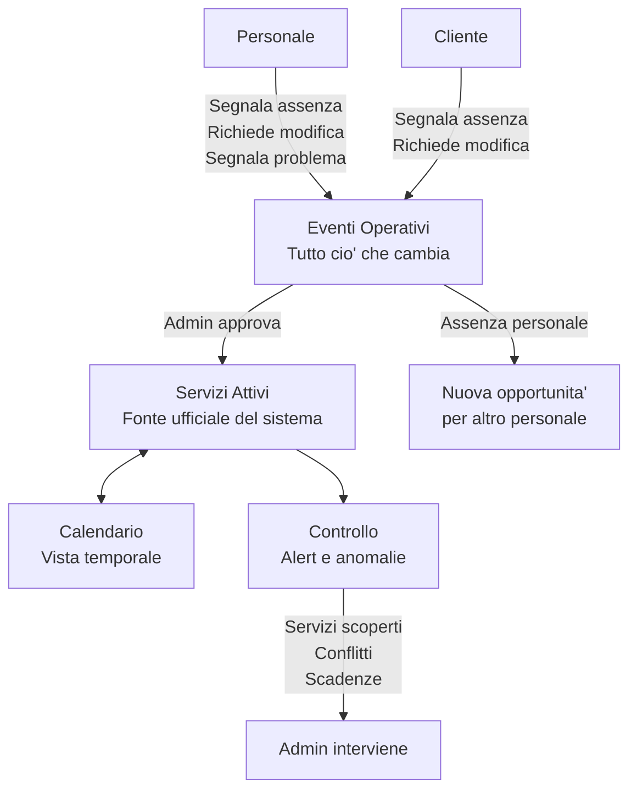

# Area Admin

## Moduli

| Modulo | Ruolo |
|---|---|
| Dashboard | KPI, alert e trend — lettura rapida dei dati |
| Acquisition | Tutto cio' che entra dall'esterno |
| Clienti | Registro operativo clienti |
| Personale | Registro operativo personale |
| Operativita' | Motore interno — coordina i servizi attivi |
| Finanza | Costi, entrate e buste paga |
| Network | Lista partner e relazioni |

---

## Flusso 1 — Acquisition

---

## Flusso 2 — Operativita'

