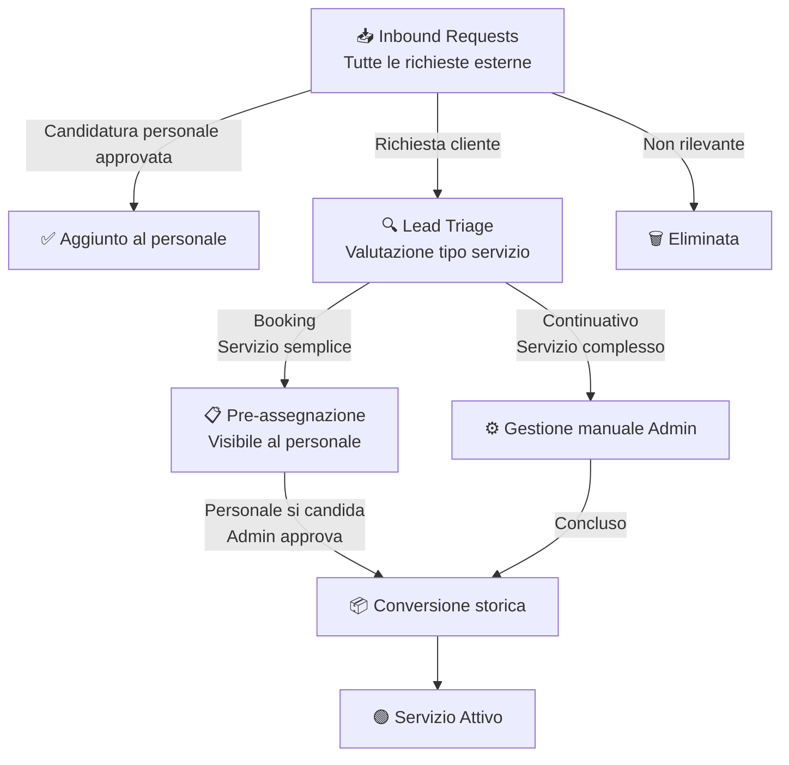

# Admin — Acquisition

## Moduli

| Modulo | Ruolo |
|---|---|
| Inbound Requests | Raccoglie tutto ciò che arriva dall'esterno |
| Lead Triage | Valuta e smista le richieste clienti |
| Pre-assegnazione | Gestisce i booking — visibile anche al personale |
| Conversione | Archivio storico delle richieste diventate servizi |

---

## Flusso

