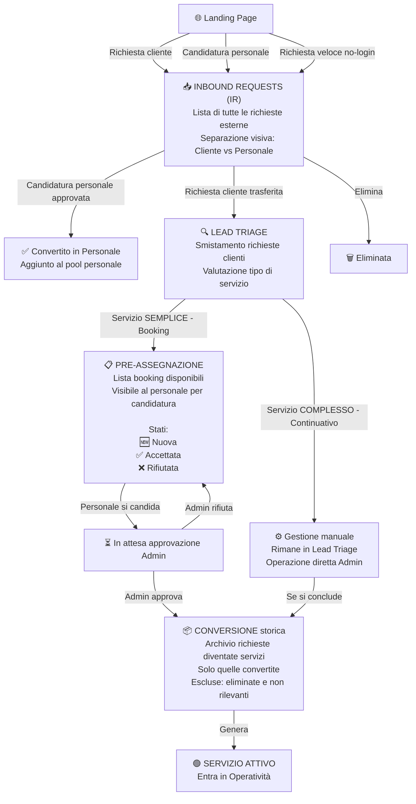
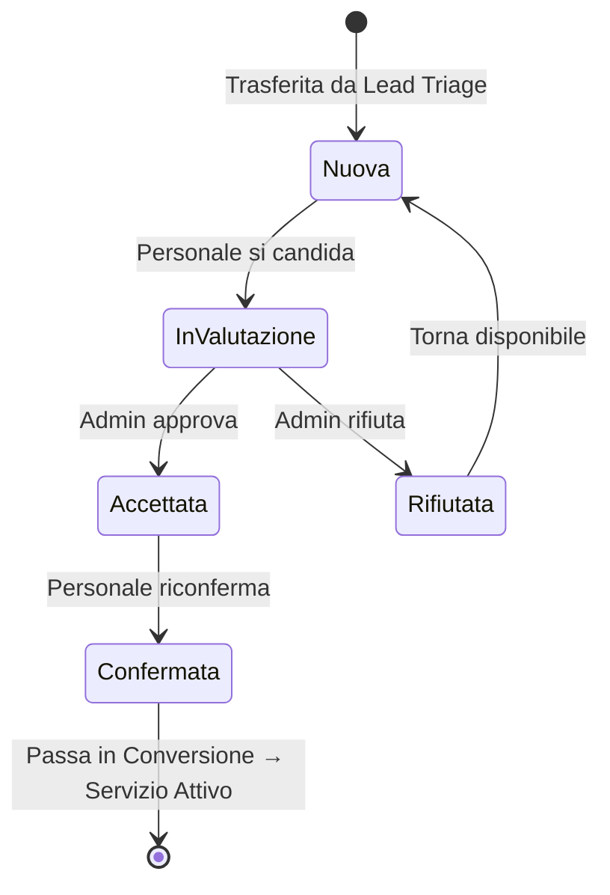

# ATLAS — Flusso Acquisition (Admin)

## Percorso completo: dalla richiesta esterna al servizio attivo

---

## Dettaglio stati richiesta in Pre-assegnazione

---

## Chi vede cosa in Acquisition

| Sotto-modulo | Visibile a | Azioni disponibili |
|---|---|---|
| Inbound Requests | Solo Admin | Apri dettaglio, aggiungi nota, converti in personale, trasferisci in Lead Triage, elimina |
| Lead Triage | Solo Admin | Classifica servizio, filtra, apri dettaglio |
| Pre-assegnazione | Admin + Personale (lista booking) | Admin: approva/rifiuta — Personale: si candida |
| Conversione | Solo Admin | Consulta storico |
