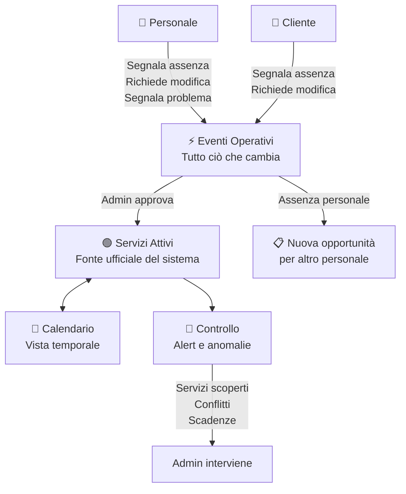

# Admin — Operatività

## Moduli

| Modulo | Ruolo |
|---|---|
| Servizi Attivi | Fonte ufficiale — la verità del sistema in ogni momento |
| Calendario | Visualizzazione temporale dei servizi attivi |
| Eventi Operativi | Gestione di tutto ciò che cambia o viene segnalato |
| Controllo | Alert e anomalie operative |

---

## Flusso

