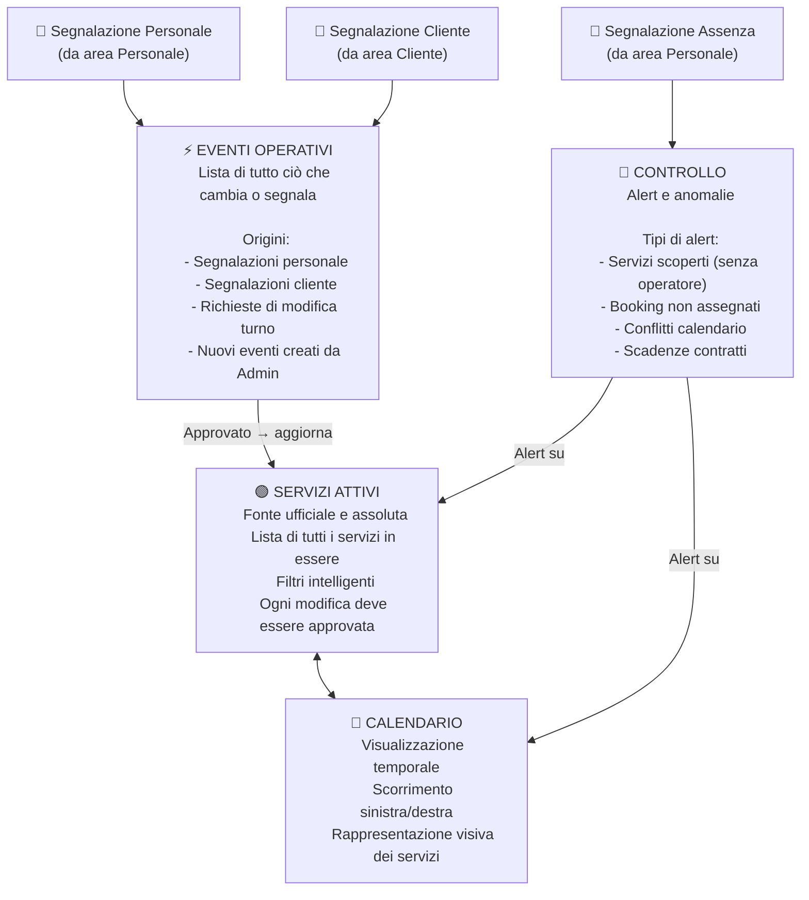
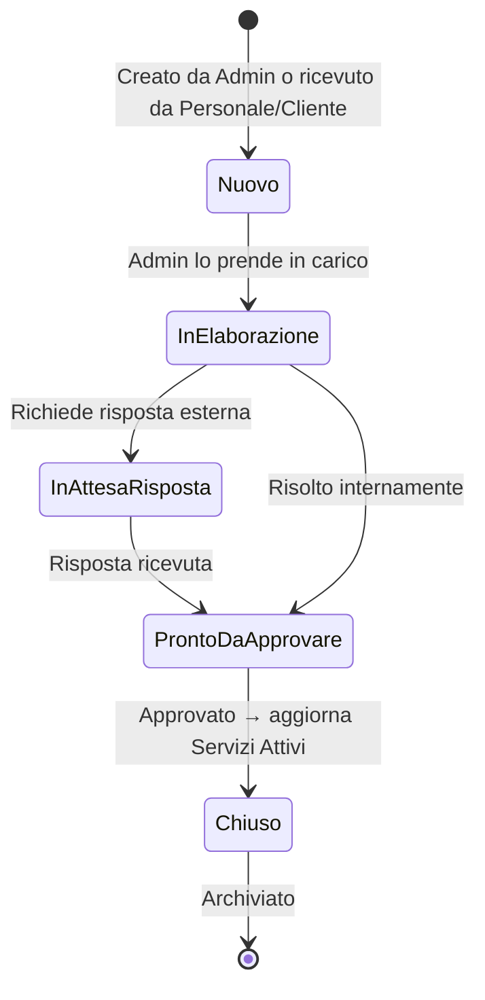
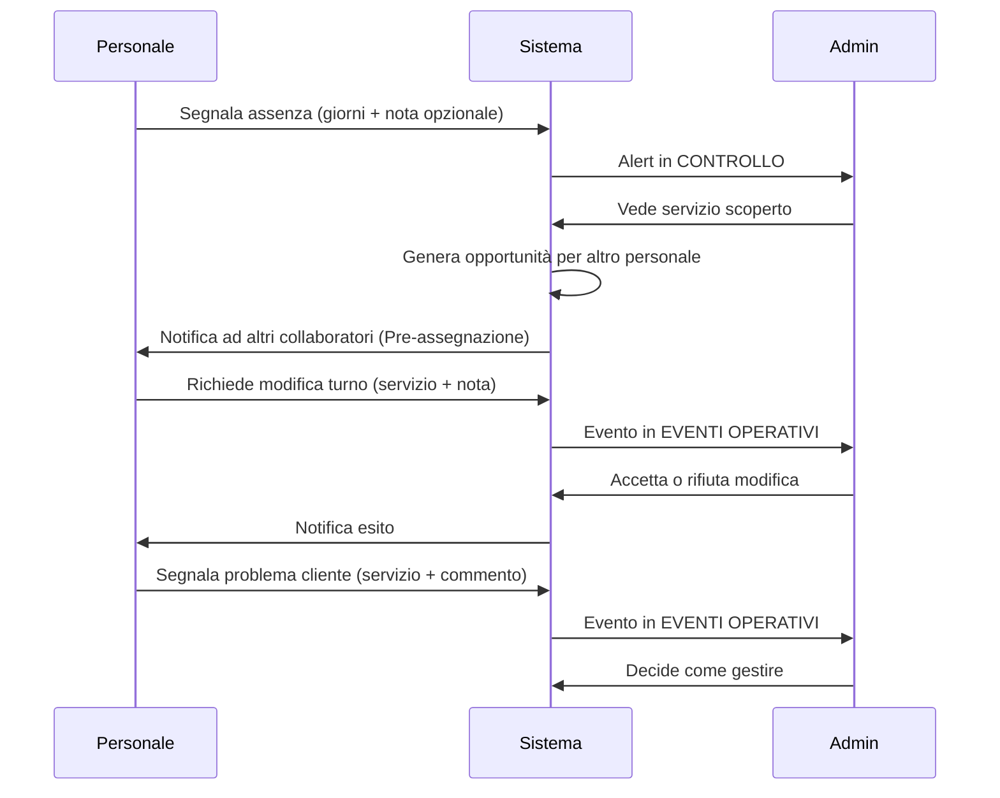

# ATLAS — Flusso Operatività (Admin)

## Il motore interno: gestione di tutto ciò che è già nel sistema



---

## Stati degli Eventi Operativi



---

## Flusso segnalazione Personale → Admin



---

## Regola fondamentale — Servizi Attivi come fonte ufficiale

```
SERVIZI ATTIVI = Verità assoluta del sistema in quel momento

Nessuna modifica diretta ai Servizi Attivi senza passare per:
  └── EVENTI OPERATIVI → approvazione Admin → aggiornamento SA
```
