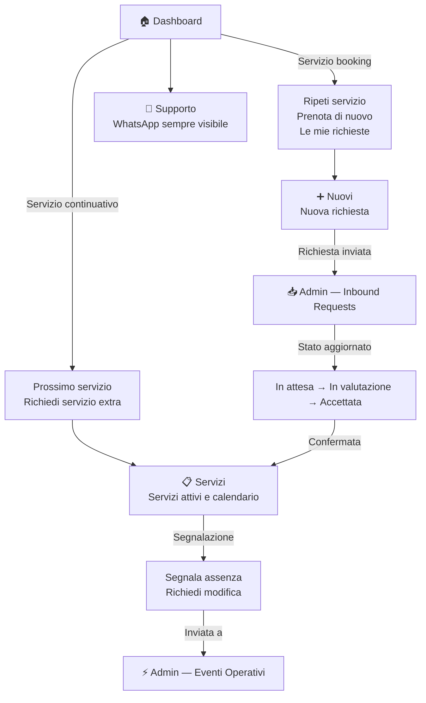

# Area Cliente

## Moduli

| Modulo | Ruolo |
|---|---|
| Dashboard | Scorciatoie intelligenti — cambia in base al tipo di servizio |
| Servizi | Lista e calendario dei servizi attivi |
| Nuovi | Richiesta nuovo servizio e stato delle richieste |
| Profilo | Dati personali, contratto, finanze |
| Supporto | Contatto rapido via WhatsApp e altri canali |

---

## Flusso

