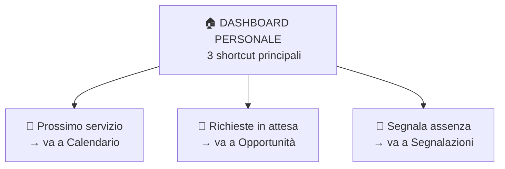
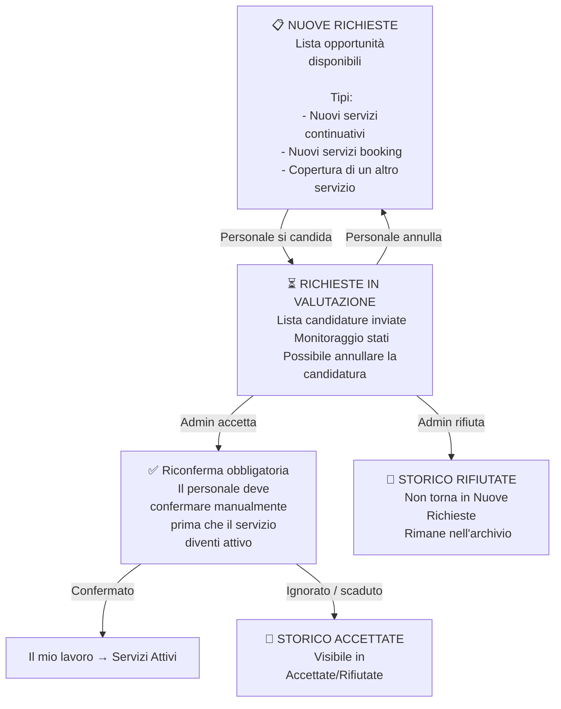
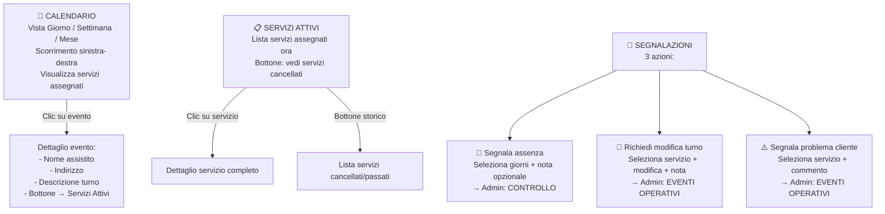
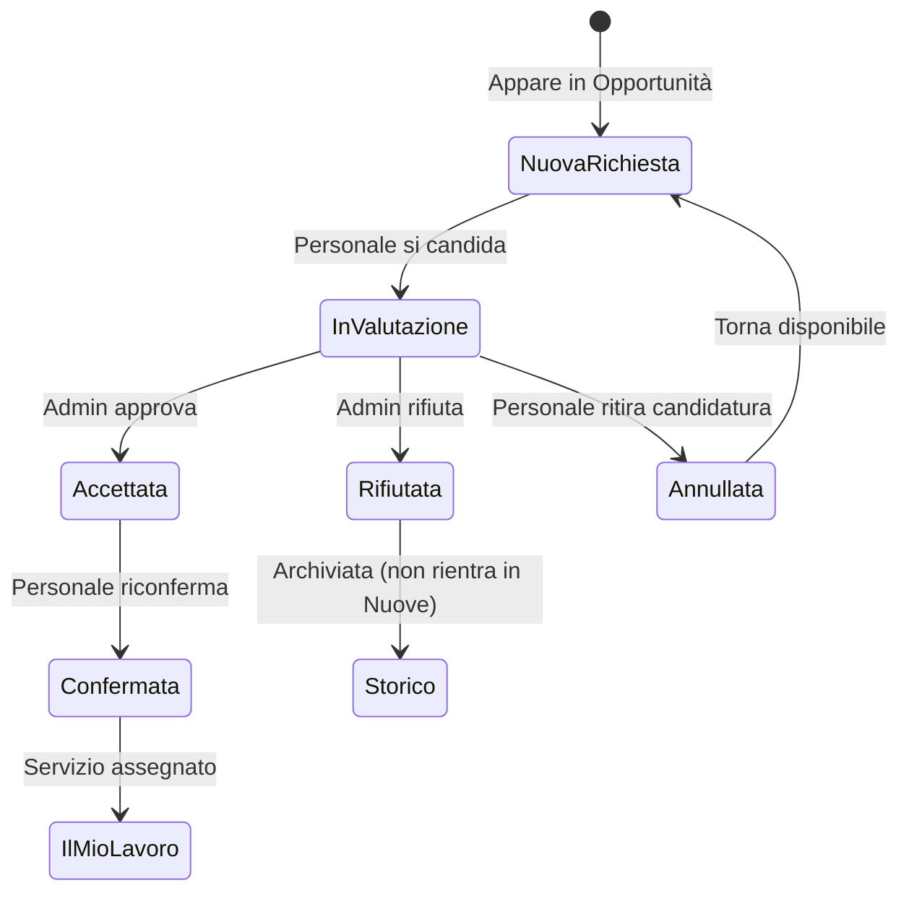

# ATLAS — Flusso Area Personale (Mobile-first)

## Dashboard Personale — Entry Point

```mermaid
flowchart TD
    DASH["🏠 DASHBOARD PERSONALE
    3 shortcut principali"]

    DASH --> B1["📅 Prossimo servizio
    → va a Calendario"]
    DASH --> B2["🔔 Richieste in attesa
    → va a Opportunità"]
    DASH --> B3["🚫 Segnala assenza
    → va a Segnalazioni"]
```

---

## Flusso Opportunità completo

```mermaid
flowchart TD
    NR["📋 NUOVE RICHIESTE
    Lista opportunità disponibili
    
    Tipi:
    - Nuovi servizi continuativi
    - Nuovi servizi booking
    - Copertura di un altro servizio"]

    NR --> |Personale si candida| RIV

    RIV["⏳ RICHIESTE IN VALUTAZIONE
    Lista candidature inviate
    Monitoraggio stati
    Possibile annullare la candidatura"]

    RIV --> |Admin accetta| RICONF
    RIV --> |Admin rifiuta| STOR_R
    RIV --> |Personale annulla| NR

    RICONF["✅ Riconferma obbligatoria
    Il personale deve confermare manualmente
    prima che il servizio diventi attivo"]

    RICONF --> |Confermato| MLV[Il mio lavoro → Servizi Attivi]
    RICONF --> |Ignorato / scaduto| STOR_A

    STOR_A["📁 STORICO ACCETTATE
    Visibile in Accettate/Rifiutate"]

    STOR_R["📁 STORICO RIFIUTATE
    Non torna in Nuove Richieste
    Rimane nell'archivio"]
```

---

## Flusso Il Mio Lavoro

```mermaid
flowchart TD
    CAL["📅 CALENDARIO
    Vista Giorno / Settimana / Mese
    Scorrimento sinistra-destra
    Visualizza servizi assegnati"]

    CAL --> |Clic su evento| DET_EV["Dettaglio evento:
    - Nome assistito
    - Indirizzo
    - Descrizione turno
    - Bottone → Servizi Attivi"]

    SA["📋 SERVIZI ATTIVI
    Lista servizi assegnati ora
    Bottone: vedi servizi cancellati"]

    SA --> |Clic su servizio| DET_SA["Dettaglio servizio completo"]
    SA --> |Bottone storico| CANC["Lista servizi cancellati/passati"]

    SEG["🔔 SEGNALAZIONI
    3 azioni:"]

    SEG --> SEG1["🚫 Segnala assenza
    Seleziona giorni + nota opzionale
    → Admin: CONTROLLO"]

    SEG --> SEG2["🔄 Richiedi modifica turno
    Seleziona servizio + modifica + nota
    → Admin: EVENTI OPERATIVI"]

    SEG --> SEG3["⚠️ Segnala problema cliente
    Seleziona servizio + commento
    → Admin: EVENTI OPERATIVI"]
```

---

## Stati candidatura Personale

```mermaid
stateDiagram-v2
    [*] --> NuovaRichiesta : Appare in Opportunità
    NuovaRichiesta --> InValutazione : Personale si candida
    InValutazione --> Accettata : Admin approva
    InValutazione --> Rifiutata : Admin rifiuta
    InValutazione --> Annullata : Personale ritira candidatura
    Accettata --> Confermata : Personale riconferma
    Confermata --> IlMioLavoro : Servizio assegnato
    Rifiutata --> Storico : Archiviata (non rientra in Nuove)
    Annullata --> NuovaRichiesta : Torna disponibile
```
