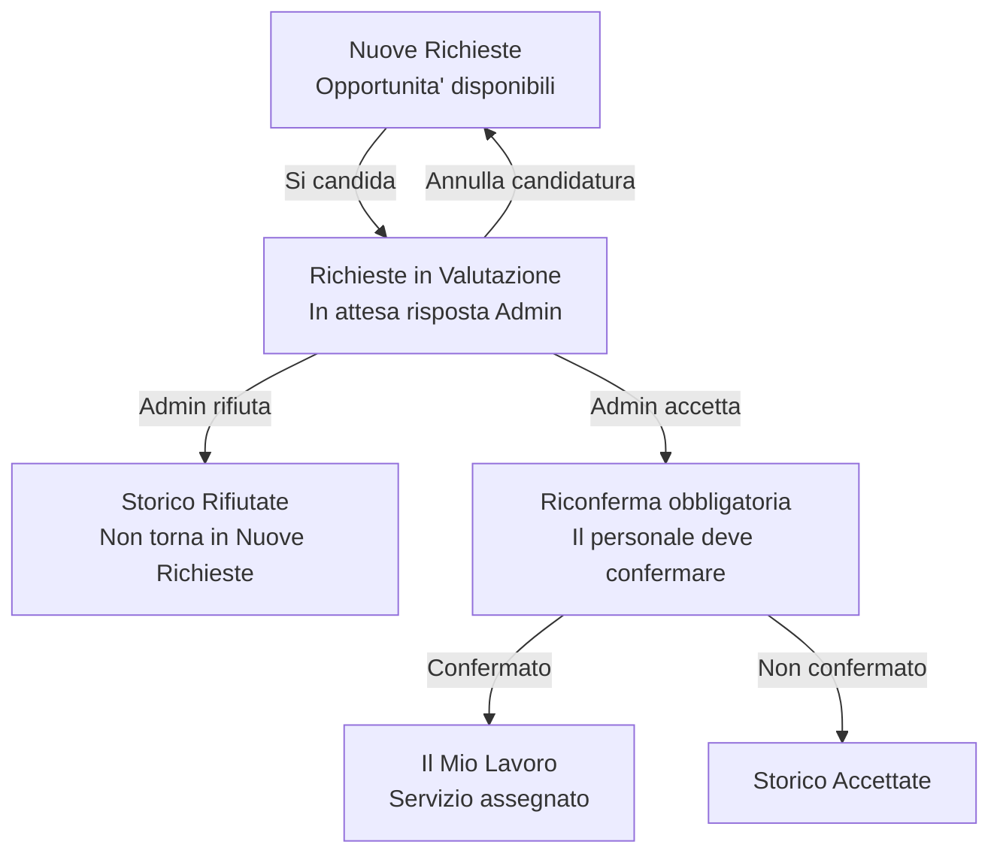
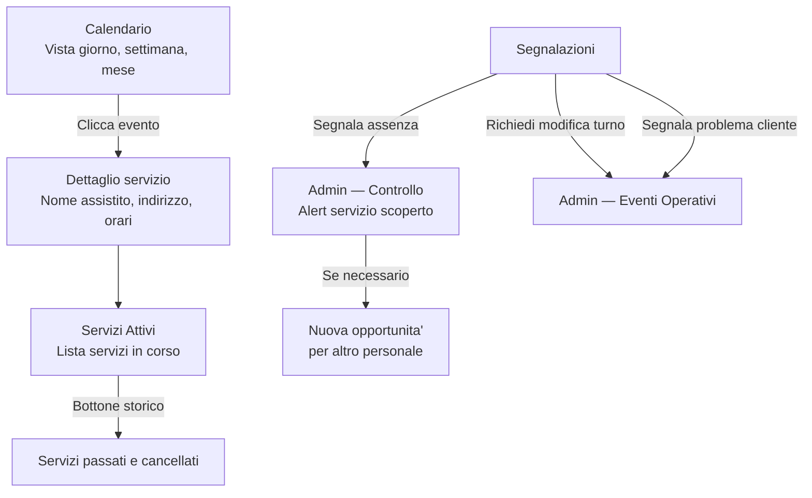

# Area Personale

## Moduli

| Modulo | Ruolo |
|---|---|
| Dashboard | Scorciatoie: prossimo servizio, richieste in attesa, segnala assenza |
| Opportunita' | Nuove richieste disponibili e gestione candidature |
| Il mio lavoro | Calendario, servizi assegnati e segnalazioni |
| Profilo | Dati personali, finanze e documenti |

---

## Flusso 1 — Nuove Richieste e Opportunita'

---

## Flusso 2 — Il Mio Lavoro

