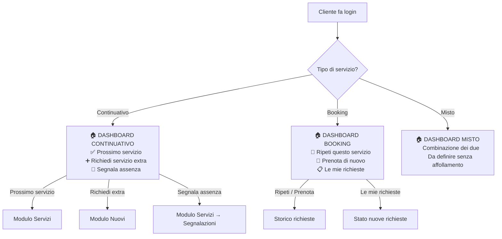
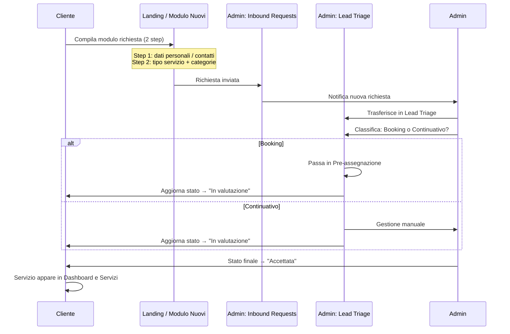
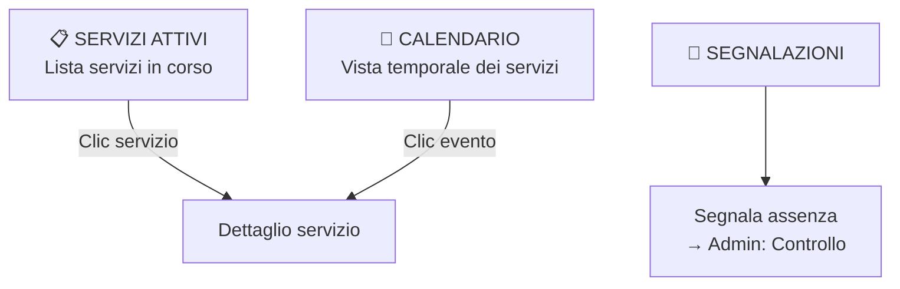
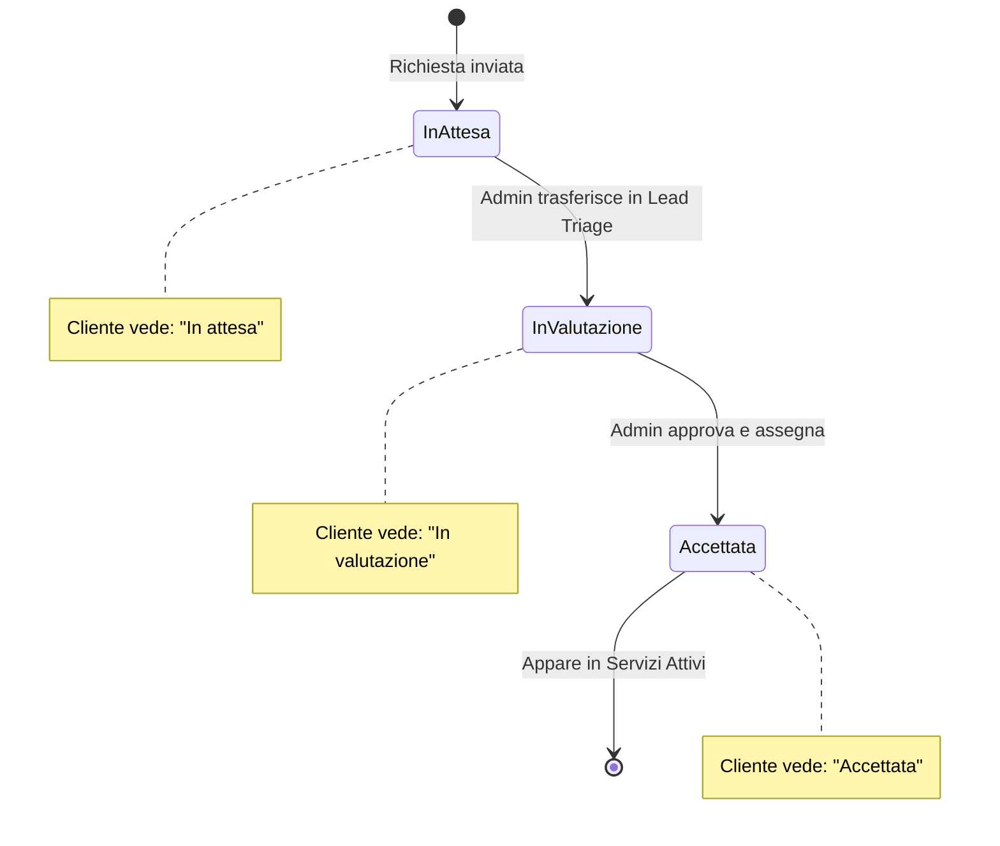
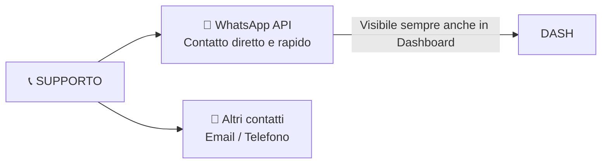

# ATLAS — Flusso Area Cliente (Mobile-first)

## Dashboard Cliente — Variante per tipo di servizio

---

## Flusso Nuova Richiesta Cliente

---

## Modulo Servizi Cliente

---

## Modulo Nuovi — Stati richiesta visibili al cliente

---

## Modulo Supporto

