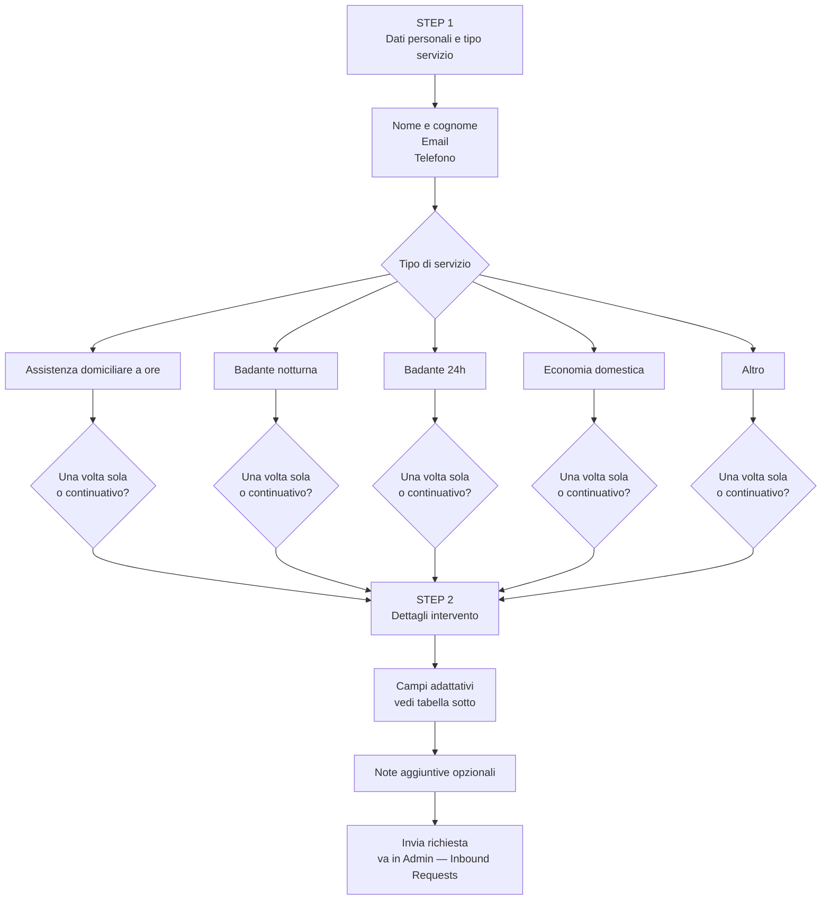

# Form Cliente — Nuova Richiesta

Il form e' diviso in 2 step. I campi del secondo step variano in base al tipo di servizio selezionato nel primo.

---

## Flusso generale

---

## Campi adattativi Step 2 per tipo di servizio

| Tipo servizio | Orario inizio | Durata intervento | Data intervento | Data inizio | Note |
|---|---|---|---|---|---|
| Assistenza domiciliare a ore — una volta | Si | Si | Si | No | Opzionale |
| Assistenza domiciliare a ore — continuativo | Si | Si | No | Si | Opzionale |
| Badante notturna — una volta | Si | No | Si | No | Opzionale |
| Badante notturna — continuativo | Si | No | No | Si | Opzionale |
| Badante 24h — una volta | No | No | Si | No | Opzionale |
| Badante 24h — continuativo | No | No | No | Si | Opzionale |
| Economia domestica — una volta | Si | Si | Si | No | Opzionale |
| Economia domestica — continuativo | Si | Si | No | Si | Opzionale |
| Altro — una volta | Si | Si | Si | No | Opzionale |
| Altro — continuativo | Si | Si | No | Si | Opzionale |

> Logica: la durata non viene chiesta per badante notturna (si intende l'intera notte) e badante 24h (si intende l'intera giornata). L'orario non viene chiesto per badante 24h.
