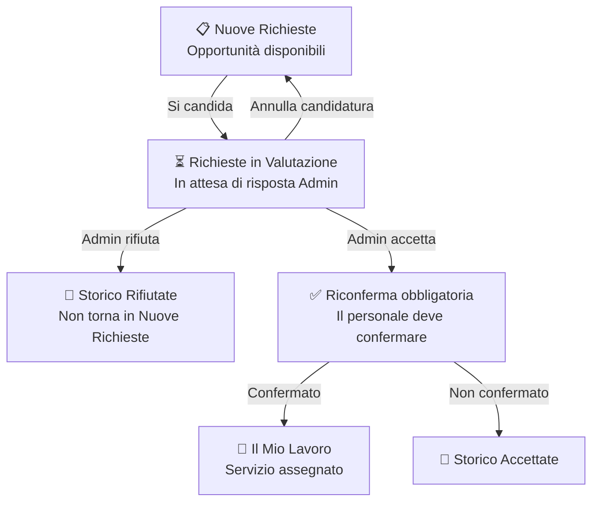

# Personale — Nuove Richieste e Opportunità

## Moduli

| Modulo | Ruolo |
|---|---|
| Nuove richieste | Lista opportunità disponibili a cui candidarsi |
| Richieste in valutazione | Candidature inviate — monitoraggio stato |
| Storico | Archivio candidature accettate e rifiutate |

---

## Flusso

