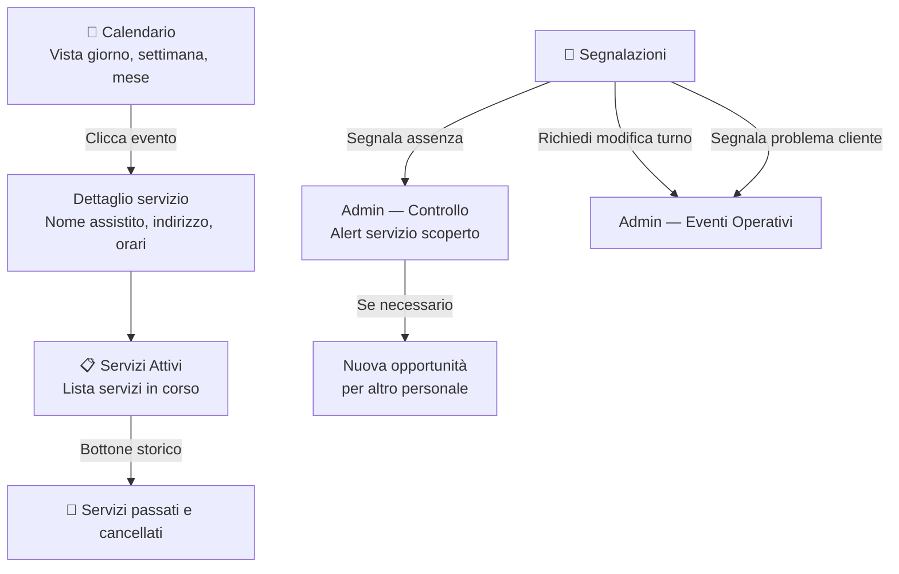

# Personale — Il Mio Lavoro

## Moduli

| Modulo | Ruolo |
|---|---|
| Calendario | Vista giorno / settimana / mese dei servizi assegnati |
| Servizi Attivi | Lista completa dei servizi in corso |
| Segnalazioni | Comunicazioni verso Admin |

---

## Flusso

