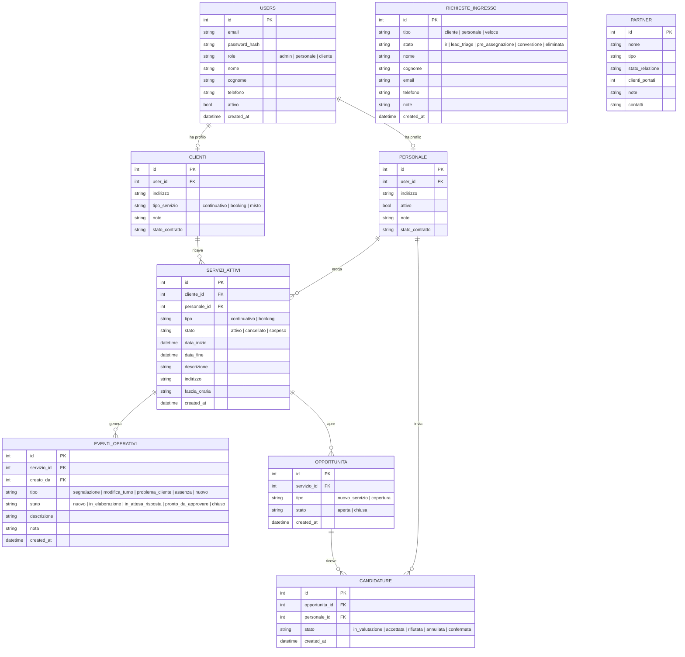

# ATLAS — Schema Database (MVP)

## Tabelle principali e relazioni

---

## Note sullo schema

| Tabella | Note |
|---|---|
| `users` | Tabella centrale. Il campo `attivo` gestisce la revoca login (quando false → accesso bloccato immediatamente) |
| `richieste_ingresso` | Unico punto di ingresso per tutto ciò che viene dall'esterno. Lo `stato` traccia il percorso in Acquisition |
| `servizi_attivi` | Fonte ufficiale. Non si modifica direttamente: ogni cambio passa per `eventi_operativi` |
| `candidature` | Traccia l'intera vita di una candidatura personale a un'opportunità |
| `partner` | Semplice anagrafica partner con tracking clienti portati |
